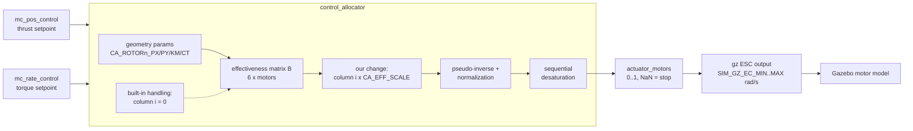
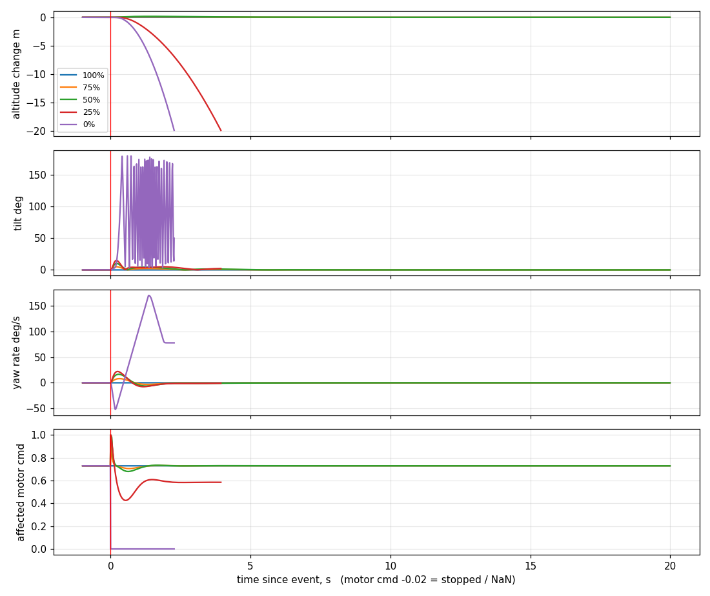
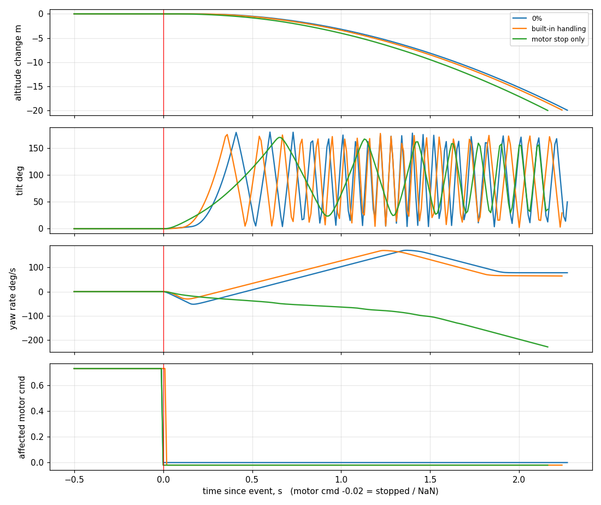

# Part 2 — Rotor effectiveness in PX4's control allocation

A runtime knob inside PX4's control allocator that scales one rotor's column of the
effectiveness matrix (100 % → 0 %) while the vehicle is flying. We then characterise what an
x500 quadrotor does at 20 m for each level, and compare complete loss (0 %) with PX4's own
motor-failure handling.

Stack: PX4 (v1.16 line) SITL · Gazebo Harmonic · airframe `gz_x500` (4001, standard quad X) ·
MAVLink (pymavlink) for the test runs · ULog for the data.

```
PART_2/
├── px4/
│   ├── patches/          two git patches for PX4-Autopilot (apply these)
│   ├── msg/, src/        the same changes as full files, at their PX4 paths
├── tools/
│   ├── run_sitl.sh       start PX4 + Gazebo x500 with the Part 2 parameters
│   ├── fly.py            takeoff to 20 m, then the reference run or the effectiveness sweep
│   ├── plot_log.py       figures + summary table from the .ulg
│   └── test_plot_log.py
├── model/
│   ├── allocation.py     PX4's allocator ported to numpy (for tests and the model)
│   ├── quad_sim.py       small closed-loop model used to predict the results
│   └── test_allocation.py
├── docs/
│   ├── allocation_notes.md   the maths behind the results
│   └── img/
└── logs/                 flight logs, CSVs and figures from the Gazebo runs
```

---

## 1. How PX4 turns a torque request into motor commands



The rate and position controllers never talk about motors. They ask for a normalized torque
(roll, pitch, yaw) and thrust. `control_allocator` owns the model of the airframe: the
**effectiveness matrix** `B`, one column per motor, saying how much roll/pitch/yaw torque
and thrust that motor produces per unit of command. For the x500 (`CA_ROTOR*` from airframe
4001, CT = 6.5):

| | motor 1 (front right, CCW) | motor 2 (rear left, CCW) | motor 3 (front left, CW) | motor 4 (rear right, CW) |
|---|---|---|---|---|
| roll | -1.43 | 1.30 | 1.43 | -1.30 |
| pitch | 0.845 | -0.845 | 0.845 | -0.845 |
| yaw | 0.325 | 0.325 | -0.325 | -0.325 |
| thrust z | -6.5 | -6.5 | -6.5 | -6.5 |

The allocator takes the pseudo-inverse of `B`, normalizes it so that a unit thrust request
gives every motor the same command (and similarly for roll/pitch/yaw), and then runs
sequential desaturation (`MC_AIRMODE=0`): roll, pitch and thrust are mixed first; if a motor
would go past 0 or 1 it lowers thrust, then roll/pitch. Yaw is added last and is the first
thing cut when it doesn't fit. The result goes to
`actuator_motors`; the Gazebo ESC output maps 0..1 to 150..1000 rad/s and NaN to stopped.

### PX4's own motor-failure handling

`failure motor off -i 1` (with `SYS_FAILURE_EN=1`) does not stop anything by itself. It
blanks motor 1's **ESC telemetry**. The failure detector (`FD_ACT_EN`) sees that ESC
time out and raises `fd_motor`. If `CA_FAILURE_MODE=1`, the allocator then zeroes that
motor's column, keeps the old normalization (`setHadActuatorFailure`), and publishes NaN for
the motor, which is what actually stops it. Commander reports "Motor failure detected" and
applies `COM_ACT_FAIL_ACT` (default: warning only).

---

## 2. The change

Two parameters, one new topic. Patch `px4/patches/0001-*`:

| | |
|---|---|
| `CA_EFF_MOTOR` | motor number, 1-based like `failure -i` (0 = off) |
| `CA_EFF_SCALE` | 0..1, multiplies that motor's whole column: roll, pitch, yaw torque and thrust |
| `rotor_effectiveness` | uORB topic with the motor, the scale and the column as the allocator uses it; published on every change and at 1 Hz, logged, and bridged to ROS 2 as `/fmu/out/rotor_effectiveness` |

The scaling happens in `ControlAllocator::update_effectiveness_matrix_if_needed()`, in the
same loop where the built-in handling zeroes a failed motor's column. So it sits at exactly
the layer the PS asks for: the allocator's effectiveness representation, before the
pseudo-inverse. Nothing downstream is touched, and neither is the motor output or the
Gazebo motor.

A few details that turned out to matter:

- **Normalization stays at the healthy value.** If the allocator re-normalized on the scaled
  matrix, the gain from the rate controller's torque request to motor command would change
  on every axis, not just for the degraded rotor. We call `setHadActuatorFailure(true)`
  while a rotor is scaled down, which is what the built-in handling does too. That is also
  why we didn't simply lower `CA_ROTOR0_CT` at runtime: it scales the same column but
  triggers re-normalization (`model/test_allocation.py::test_normalization_is_frozen_while_degraded`).
- **Never starts degraded.** New allocator objects compute their normalization from the
  first matrix they see, so `CA_EFF_SCALE` is reset to 1 whenever they are created: at
  startup and when `CA_AIRFRAME` or `CA_METHOD` change. A NaN scale counts as 1, and a
  motor number beyond the motor count is ignored with a warning.
- **Live and visible.** A parameter change reaches the allocator on its next parameter
  update (PX4 rate-limits these to once per second, which is why the test runs change the
  level at most every few seconds). Each change prints `Motor 1 effectiveness 50%` on the
  PX4 console and as a MAVLink status text. `control_allocator status` in the `pxh>` shell
  prints the effectiveness matrix actually in use.

It can be driven from the `pxh>` shell (`param set CA_EFF_SCALE 0.5`), from QGC, or over
MAVLink. `tools/fly.py` uses MAVLink.

### What the scale means physically

Lowering the scale changes what the allocator **believes** about motor 1. The real motor is
still healthy. So:

- **0 < scale < 1:** the allocator thinks motor 1 is weak and drives it harder to get the
  torque it wants. At 75 % the hover command for motor 1 goes from 0.73 to 0.97. From 50 %
  down, motor 1 hits 100 % at hover, and to keep what it believes is a torque balance the
  allocator gives up collective thrust. Meanwhile the real, healthy motor 1 at full power
  rolls the vehicle left, pitches it up and yaws it right. The rate controller's integrators
  then have to find new torque requests that bring the motors back to the physical hover
  trim. Whether they can is what decides the outcome (`docs/allocation_notes.md`).
- **scale = 0:** the column is zero and the pseudo-inverse assigns motor 1 exactly 0. That is
  the same allocation the built-in handling produces, except the motor idles at
  `SIM_GZ_EC_MIN` (150 rad/s, about 4 % of its hover thrust) instead of being stopped. The
  vehicle is flying on three rotors, and it knows it.

---

## 3. Phase 1 — setup, takeoff to 20 m, reference

- Airframe `gz_x500` (4001): PX4's standard quad X with the default multicopter allocation.
  Same Gazebo Harmonic install as Part 1.
- `tools/fly.py` sets `MIS_TAKEOFF_ALT=20`, arms normally and sends `MAV_CMD_NAV_TAKEOFF`.
  PX4 climbs in Takeoff mode and holds in Hold mode (GPS is fine here). The script waits
  until the altitude is within 0.5 m and the tilt under 5° for 5 s.
- Reference: `fly.py reference` injects `failure motor off -i 1` (MAVLink
  `MAV_CMD_INJECT_FAILURE`) with `CA_FAILURE_MODE=1` and `COM_ACT_FAIL_ACT=0`.

**On a stock SITL build the injection is accepted and nothing happens.** The Gazebo ESC
interface (`GZMixingInterfaceESC`) publishes `esc_status` without `actuator_function` and
without a current. Both the failure injector and the failure detector map ESCs to motors
through `actuator_function`, so every ESC is skipped: no telemetry is blanked, nothing is
detected, the allocator is never told, and motor 1 keeps spinning. Patch
`px4/patches/0002-*` adds the two fields (the current is a simple speed² stand-in) so the
built-in chain runs end to end in simulation. It only changes the simulated ESC telemetry;
detection, allocation and failsafe logic are untouched. (Newer PX4, after Sept 2025, stops
the motor on injection directly, but still leaves the allocator unaware unless the ESC
telemetry reports the failure.)

---

## 4. Running it

```bash
# 1. patch and build PX4 (from your PX4-Autopilot checkout)
cd ~/PX4-Autopilot
git am -3 /path/to/PART_2/px4/patches/*.patch      # or: git apply -C1 ... on v1.16.0
make px4_sitl

# 2. python deps for the tools
pip install pymavlink pyulog matplotlib numpy

# 3. terminal 1: PX4 + Gazebo x500
PART_2/tools/run_sitl.sh --gui

# 4. terminal 2: the runs (restart PX4 between runs that end on the ground)
cd PART_2/logs
python3 ../tools/fly.py reference              # Phase 1 reference
python3 ../tools/fly.py sweep                  # 100 -> 75 -> 50 -> 25 -> 0 %
python3 ../tools/fly.py sweep --levels 0       # complete loss on its own

# 5. figures and tables
python3 ../tools/plot_log.py ~/PX4-Autopilot/build/px4_sitl_default/rootfs/log/<date>/<file>.ulg
python3 ../tools/plot_log.py ref.ulg zero.ulg --compare --labels "built-in" "0 %"
```

To see the topic from ROS 2, copy `px4/msg/RotorEffectiveness.msg` into
`px4_msgs/msg/` in your ROS workspace and rebuild `px4_msgs`.

---

## 5. Results

### Gazebo SITL

<!-- Filled from logs/ after the Gazebo runs: one row per level from plot_log.py's summary.md. -->

| level | altitude loss | max tilt | max yaw rate | motor 1 at end | outcome |
|---|---|---|---|---|---|
| 100 % | 0.0 m | 0° | 0°/s | 0.73 | holds |
| 75 % | 0.0 m | 7° | 10°/s | 0.73 | holds after a short transient |
| 50 % | 0.0 m | 17° | 48°/s | 0.75 | holds after a transient |
| 25 % | 19.7 m (ground) | 25° | 35°/s | 0.61 | came down upright, ground after 3.6 s |
| 0 % | 19.4 m (ground) | 179° (tumbles) | 190°/s | 0.00 (idle) | tumbles, ground after 2.2 s |
| built-in (motor off) | 22.0 m (ground) | 179° (tumbles) | 1075°/s | 0.00 (stopped) | tumbles, ground after 2.1 s |

Figures: `logs/` (individual event plots in `logs/sweep/results/`, `logs/zero/results/`, `logs/reference/results/`, and `logs/compare.png`).

Comparison with model prediction:
- 100 %, 75 % and 50 % hold hover with 0 m altitude loss. Gazebo exhibits slightly larger transients (7° vs 5° at 75 %; 17° / 48°/s vs 10° / 17°/s at 50 %) due to real sensor noise, EKF estimation delay, and actuator response dynamics not present in the simplified model.
- At 25 % the vehicle cannot produce sufficient collective thrust to hover while counteracting the asymmetry; it remains upright (max tilt 25°) and reaches the ground in 3.6 s (model predicted 3.9 s at 15° tilt).
- At 0 % the vehicle tumbles and hits the ground in 2.2 s (model predicted 2.3 s).
- Built-in failure handling reaches the ground in 2.1 s (model predicted 2.2 s), within 0.1 s of complete loss (0 %), while experiencing violent spin (1075°/s) during the descent due to zero thrust on motor 1 vs idle spin in 0 %.

### Model prediction

Before flying in Gazebo we ran the same allocator (ported to Python) in a small closed-loop
model of the x500 with PX4's default controller gains (`model/quad_sim.py`). It has no
sensor noise, no EKF and no ground effect, so treat it as the expected shape rather than as
data.

| case | alt loss (m) | max tilt | max yaw rate | motor 1 cmd after | outcome |
|---|---|---|---|---|---|
| 100 % | 0.0 | 0° | 0°/s | 0.73 | holds |
| 75 % | 0.0 | 5° | 8°/s | 0.73 | holds after a short transient |
| 50 % | 0.0 | 10° | 17°/s | 0.73 | holds after a short transient |
| 25 % | 20 (ground) | 15° | 22°/s | 0.58 | stays upright but can't make hover thrust, reaches the ground in 3.9 s |
| 0 % | 20 (ground) | tumbles | 171°/s | 0 (idle) | tumbles, ground in 2.3 s |
| built-in handling | 20 (ground) | tumbles | 170°/s | stopped | tumbles, ground in 2.2 s |
| motor stop only* | 20 (ground) | tumbles | 228°/s | stopped | tumbles, ground in 2.2 s |

\* motor stopped without telling the allocator: `CA_FAILURE_MODE=0`, or newer PX4 without
detection.



In the model the vehicle keeps its hover down to 40 % and loses it at 35 %. That matches
where the allocator can no longer reproduce the hover trim at all (39 %): below it, motor 1's
command already passes 100 % before yaw is mixed in, so desaturation cuts thrust. Below
about 31 % the roll torque the integrator would have to hold also exceeds
`MC_RR_INT_LIM` (0.3). Details and numbers are in `docs/allocation_notes.md`.

---

## 6. Complete loss vs PX4's built-in handling



At the allocation level the two are the same: motor 1's column is zero and the normalization
is kept from the healthy airframe (`test_zero_scale_matches_builtin_failure_handling`), so
for the same request both produce the same commands for motors 2–4. What differs:

1. **How the allocator finds out.** Ours changes the matrix directly. The built-in path
   depends on ESC telemetry → failure detector → `failure_detector_status` → allocator. In
   stock SITL that chain never completes (section 3). With the telemetry patch it is quick,
   because the blanked ESC report has timestamp 0 and times out on the first check, but
   until then the real motor keeps full thrust while the allocator still counts on it.
   `plot_log.py` reports this delay per run.
2. **The motor output.** The built-in handling also forces the motor to NaN (stopped). Our
   mechanism doesn't touch outputs, so motor 1 gets the allocator's 0 and idles at
   150 rad/s, about 4 % of its hover thrust and a little reaction torque.
3. **The rest of the system.** Only the built-in path raises `fd_motor`, so only it shows up
   in commander ("Motor failure detected"), in health reporting, and in `COM_ACT_FAIL_ACT`
   (Hold/Land/RTL/Terminate if configured). Our scaling is invisible to commander.
4. **Reversibility and configuration.** Ours goes back to 100 % immediately. The built-in
   handling only restores after the failure detector clears, and while a failure is handled
   the allocator ignores parameter changes.
5. **Physics.** Neither recovers. Three rotors can't hold roll, pitch and yaw at the same
   time, and PX4's desaturation gives up yaw and thrust first. The vehicle spins up and
   tumbles. The model has the two trajectories within about 0.1 s of each other; the
   idle thrust in our case slightly delays the flip.

The more interesting contrast is "motor stop only". There the allocator keeps commanding
a dead motor as if it were fine. The vehicle yaws the other way and tumbles more slowly but
just as surely. So telling the allocator (built-in handling or our 0 %) doesn't save the
airframe. It changes how it fails.

---

## 7. Notes and limits

- The model predictions are from a simplified model. The Gazebo numbers are the ones that count.
- The ESC current added for SITL is a stand-in. It only needs to be non-zero and
  plausible for the failure detector's checks.
- One motor at a time, scale in [0, 1]. The built-in handling also only handles the first failure.
- While the built-in handling has a motor removed, the allocator ignores parameter updates
  (upstream behaviour). A `CA_EFF_SCALE` change made in that window only takes effect at
  the next parameter change after the failure clears, so don't mix the two in one flight.
- The 25–40 % region depends on PX4's rate integrator limits and on the desaturation order,
  so a differently tuned airframe will move that boundary.
- No detection or recovery logic was added anywhere. Going back to 100 % between levels in
  `fly.py sweep` is a fixed test schedule so that each level starts from a settled 20 m
  hover; it is not triggered by what the vehicle does.
